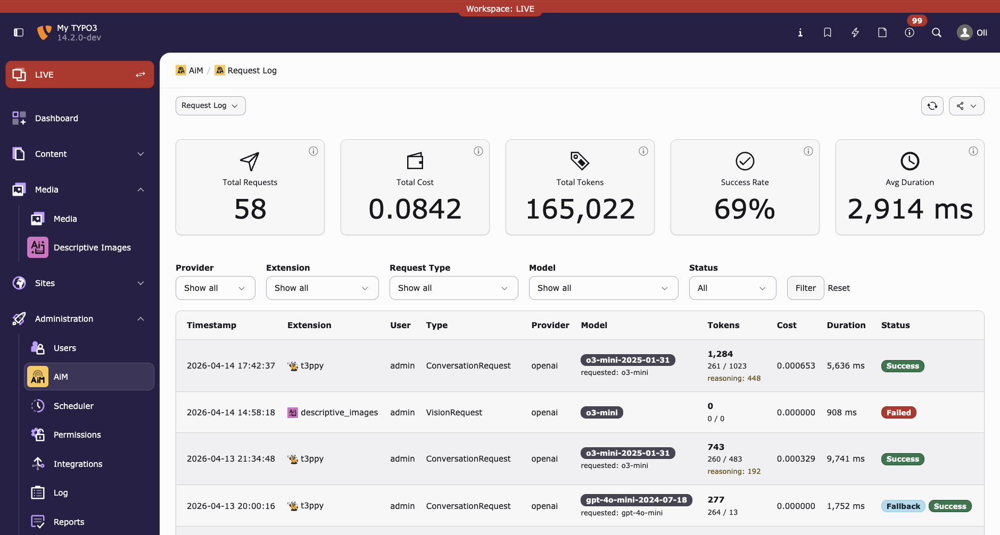
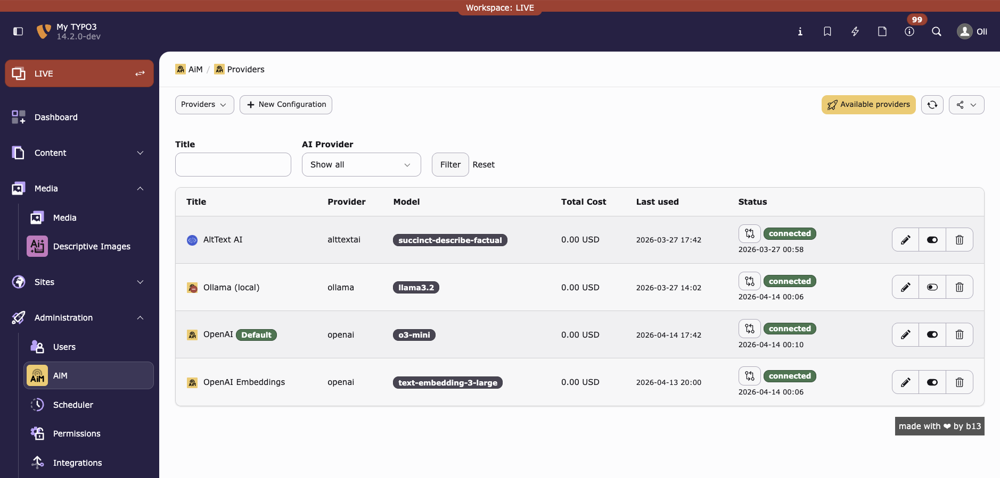
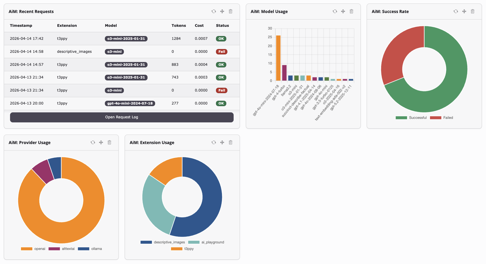

# AiM: The AI Brain for Your TYPO3 Website

## One extension. Every AI provider. Full control.

AiM connects your TYPO3 website to the world of artificial intelligence without locking you into a single vendor, without exposing your API keys to every extension, and without losing visibility into what AI is doing on your site.

Think of AiM as the **central switchboard** for all AI operations in TYPO3. Your extensions ask for what they need: "describe this image", "translate this text", "generate a meta description". AiM handles everything else: picking the right provider, routing to the right model, logging the request, tracking costs, and enforcing your security policies.

---

## Why AiM?

### The problem without AiM

Every TYPO3 extension that wants to use AI needs its own OpenAI integration. That means:
- API keys scattered across multiple extensions
- No overview of what AI is being used for
- No cost control, any extension can burn through your budget
- No way to switch providers without changing extension code
- No security boundaries, HR data could end up at a cloud provider

### The AiM approach

AiM sits between your extensions and AI providers. Extensions never touch API keys, never choose models, never talk to providers directly. They simply say what they need, and AiM delivers.

**For site administrators**, this means:
- One place to manage all AI provider configurations
- Full visibility into every AI request (who, what, when, how much)
- Budget limits per user or group
- Privacy controls for sensitive data
- The freedom to switch providers anytime

**For extension developers**, this means:
- Three lines of code to add AI to any feature
- No need to implement provider-specific APIs
- Automatic fallback if a provider goes down
- Smart routing that picks the cheapest model for simple tasks

---

## What can AiM do?

### Image analysis and alt text generation

Upload an image, get a description back. Perfect for accessibility: generate alt text for every image in your media library automatically.

### Content generation

Write meta descriptions, generate summaries, create content drafts. Tell AiM what you need and which tone to use.

### Translation

Translate content between any languages your AI provider supports. Tone, context, and meaning are maintained automatically.

### Conversations and chatbots

Build interactive chat experiences in the TYPO3 backend or frontend. Multi-turn conversations with context awareness, including streaming support for real-time token output.

### Embeddings and semantic search

Generate vector embeddings for content. Enable semantic search, find related content, build recommendation engines.

### Tool calling and agentic workflows

Let AI interact with your TYPO3 data. AI can call functions you define: query records, trigger actions, process data.

---

## How it works for administrators

### 1. Install AiM and a provider bridge

```bash
composer require b13/aim
```

AiM itself has no AI provider built in. You choose what you need:

| Provider | Package | Use case |
|---|---|---|
| **OpenAI** (GPT-4.1, GPT-4o) | `symfony/ai-open-ai-platform` | Best all-rounder, vision, embeddings |
| **Anthropic** (Claude) | `symfony/ai-anthropic-platform` | Strong reasoning, long context |
| **Google Gemini** | `symfony/ai-gemini-platform` | 1M token context window |
| **Mistral** | `symfony/ai-mistral-platform` | European hosting, fast |
| **Ollama** (local) | `symfony/ai-ollama-platform` | On-premise, no data leaves your server |

Install any bridge and AiM detects it automatically. No configuration needed beyond the Composer install.
Of course, you can also create your own providers.

### 2. Create a provider configuration

In the TYPO3 backend, go to **Admin Tools > AiM > Providers** and create a new configuration:

- Pick your provider from the dropdown (auto-populated from installed bridges)
- Enter your API key (or endpoint URL for Ollama)
- Select a model
- Optionally mark as default

Click the verify button to confirm the connection works. You'll see "connected" with the timestamp.

**Alternative: site settings YAML.** Extensions can also resolve provider configurations from your site's `settings.yaml` without any database records. This is useful for simple setups or automated deployments where you want to keep AI configuration in version control alongside your site config.

### 3. You're done

Every extension using AiM now has AI capabilities. No further configuration needed for basic usage.

---

## Smart features that save money

### Intelligent model routing

AiM analyzes each prompt's complexity before sending it to an AI provider. A simple "What is PHP?" doesn't need GPT-4.1. A smaller, cheaper model handles it just fine. AiM learns from your request history which models work well for which types of questions and automatically routes to the most cost-effective option.

This happens transparently. Your extensions don't need to change anything.

### Auto model switching

You configured OpenAI with GPT-4.1 for chat. But an extension needs embeddings, and GPT-4.1 can't do that. Instead of failing, AiM automatically switches to the cheapest capable model (e.g. `text-embedding-3-small`) using the same API key. The selection is data-driven: AiM uses historical cost data from the request log to pick the cheapest model with a proven success rate. One configuration covers all AI capabilities.

The auto switch is controllable:
- Per configuration: toggle on/off in the provider record
- Per user/group: `aim.autoModelSwitch = 0` in TSconfig
- Admins always bypass restrictions

### Fallback chains

If your primary provider is down or returns an error, AiM automatically retries with the next available provider. Your users never see a failure.

---

## Security and governance

### Who can use what

Restrict AI capabilities per backend user group using TYPO3's standard permission system:

- **Text generation**: allow or deny per group
- **Vision** (image analysis): restrict to editors who need it
- **Translation**: enable for translators only
- **Embeddings, tool calling**: keep for developers

If no restrictions are configured, everything is allowed (permissive by default). Restrictions only kick in when you explicitly set them in any group.

### Provider access control

Different teams, different providers. Your HR department uses a local Ollama instance for confidential employee data. Marketing uses OpenAI for content generation. AiM ensures:

- **Group-based provider restrictions**: only HR group members can access the HR Ollama configuration
- **Rerouting protection**: the smart router will never send HR data to a cloud provider
- **Privacy levels**: mark the HR configuration as "no logging" so prompts and responses aren't stored

### Budget limits

Set spending limits per user or group via TYPO3's UserTSconfig:

```
aim.budget.period = monthly
aim.budget.maxCost = 50.00
aim.budget.maxTokens = 500000
aim.budget.maxRequests = 1000
```

When the limit is reached, requests are blocked with a clear message. Budgets are tracked per user in rolling periods (daily/weekly/monthly).

**This applies to everyone, including admins.** AI requests can get expensive, especially with vision or reasoning models. Budget limits act as a safety net: even an admin who accidentally triggers a bulk operation will be stopped before costs escalate. Admins can set their own limits via UserTSconfig.

### Rate limiting

Prevent individual users from making too many requests:

```
aim.rateLimit.requestsPerMinute = 10
```

---

## Full visibility

### Request log

Every AI request is tracked in the **AiM > Request Log** module:

- **What was asked**: prompt and response content is stored per request (respects privacy levels), accessible via the database for debugging
- **Which model answered**: requested model vs. actually used model
- **How much it cost**: token counts (prompt, completion, cached, reasoning) and calculated cost
- **How complex it was**: AiM's complexity classification (simple/moderate/complex) with the scoring reason
- **How long it took**: wall-clock duration in milliseconds
- **Who asked**: the backend username is displayed for each request, so you can see which user triggered it. Automated/CLI requests show no user.
- **Which extension**: the calling extension key is shown per request
- **Rerouting details**: whether the request was rerouted (fallback, capability validation, smart routing) and why

Filter by provider, extension, request type, or success/failure. Statistics dashboard shows totals at a glance.



### Provider verification

Click the verify button next to any provider configuration to test the connection. See "connected" or "disconnected" with the exact error message. Results are persisted so you see the last check status on every page load.



### Disabled models

In the Available Providers modal, click any model badge to disable it. Disabled models:
- Don't appear in the model selection dropdown
- Are never picked by the resolver, smart router, or auto model switch
- Are blocked by the capability validation middleware as a safety net

### Dashboard widgets

If the TYPO3 Dashboard extension is installed, AiM adds five widgets you can place on any dashboard:

- **Recent Requests**: a live table of the latest AI requests with model, tokens, cost, and status
- **Provider Usage**: doughnut chart showing how requests are distributed across providers
- **Model Usage**: bar chart showing request counts per model
- **Success Rate**: doughnut chart of successful vs failed requests
- **Extension Usage**: doughnut chart showing which extensions use AI the most

A pre-configured dashboard preset ("AiM: AI Analytics") is available when creating a new dashboard, placing all five widgets at once.



---

## For extension developers

Adding AI to your TYPO3 extension takes a few lines:

```php
public function __construct(
    private readonly \B13\Aim\Ai $ai,
) {}

// Generate alt text for an image
$response = $this->ai->vision(
    imageData: base64_encode($imageContent),
    mimeType: 'image/jpeg',
    prompt: 'Generate alt text for this image',
    extensionKey: 'my_extension',
);

echo $response->content;
// "A golden retriever playing fetch in a sunny park"
```

Your extension doesn't know or care which AI provider is used. The admin decides. You just describe what you need.

### All proxy methods

```php
// Vision
$response = $this->ai->vision($imageData, 'image/jpeg', 'Describe this', extensionKey: 'my_ext');

// Text generation
$response = $this->ai->text('Write a summary of...', maxTokens: 200, extensionKey: 'my_ext');

// Translation
$response = $this->ai->translate('Hello', 'English', 'German', extensionKey: 'my_ext');

// Conversation
$response = $this->ai->conversation([new UserMessage('Hi')], extensionKey: 'my_ext');

// Streaming conversation
$response = $this->ai->conversationStream([new UserMessage('Tell me about TYPO3')], extensionKey: 'my_ext');
foreach ($response->streamIterator as $chunk) {
    echo $chunk;
    flush();
}

// Embeddings
$response = $this->ai->embed('TYPO3 is a CMS', dimensions: 256, extensionKey: 'my_ext');
```

### Request a specific provider

If your extension specifically needs OpenAI (e.g. for vision quality), request it but gracefully fall back if it's not available:

```php
$response = $this->ai->vision(
    imageData: $data,
    mimeType: 'image/jpeg',
    prompt: 'Describe this product photo',
    provider: 'openai:*',  // prefer OpenAI, admin picks the model
    extensionKey: 'my_shop',
);
```

If OpenAI isn't configured, AiM uses whatever default provider the admin set up. Your extension never breaks.

### Fluent builder for more control

```php
$response = $this->ai->request()
    ->vision($imageData, 'image/jpeg')
    ->prompt('Generate alt text')
    ->systemPrompt('You are an accessibility expert.')
    ->maxTokens(100)
    ->temperature(0.3)
    ->provider('openai:*')
    ->from('my_extension')
    ->send();
```

### Register your own AI provider

Any extension can add AI providers:

```php
#[AsAiProvider(
    identifier: 'my-provider',
    name: 'My Custom AI',
    supportedModels: ['my-model-v1' => 'My Model v1'],
)]
class MyProvider implements AiProviderInterface, TextGenerationCapableInterface
{
    public function processTextGenerationRequest(TextGenerationRequest $request): TextResponse
    {
        // Your implementation
    }
}
```

Auto-discovered via the PHP attribute. No registration code needed.

### Add custom middleware

Intercept all AI requests for custom logic:

```php
#[AsAiMiddleware(priority: 50)]
class MyMiddleware implements AiMiddlewareInterface
{
    public function process(
        AiRequestInterface $request,
        AiProviderInterface $provider,
        ProviderConfiguration $configuration,
        AiMiddlewareHandler $next,
    ): TextResponse {
        // Before: inspect, modify, or block the request
        $response = $next->handle($request, $provider, $configuration);
        // After: inspect or modify the response
        return $response;
    }
}
```

---

## Requirements

- TYPO3 v12.4, v13.4, or v14.0+
- PHP 8.1+
- At least one AI provider bridge (see table above)

## License

GPL-2.0-or-later

## Credits

Created by [Oli Bartsch](https://github.com/o-ba) for [b13 GmbH, Stuttgart](https://b13.com).
