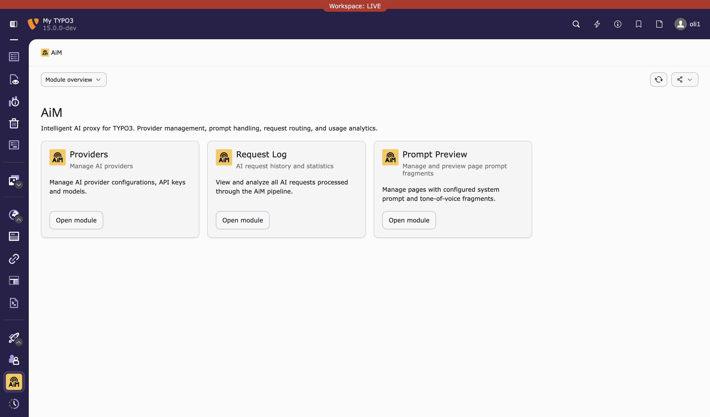
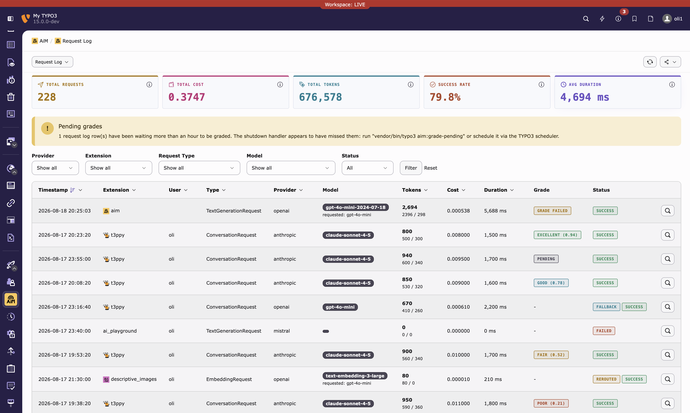
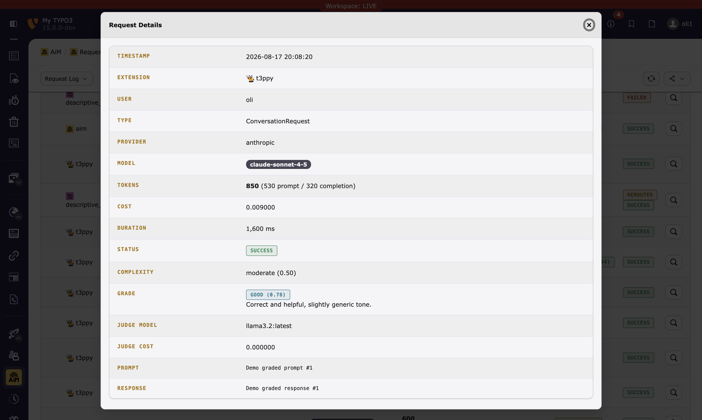
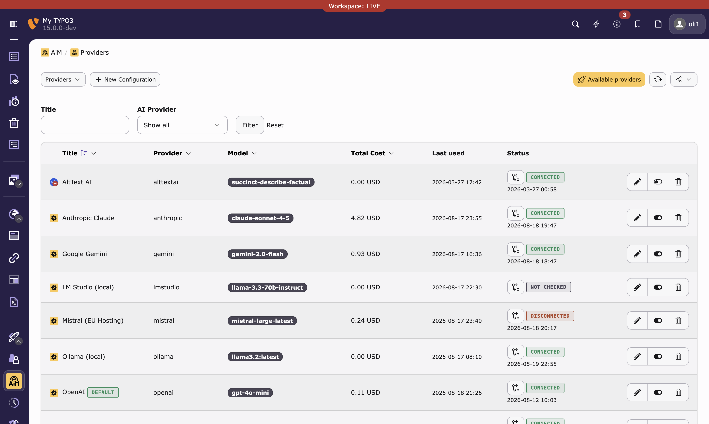
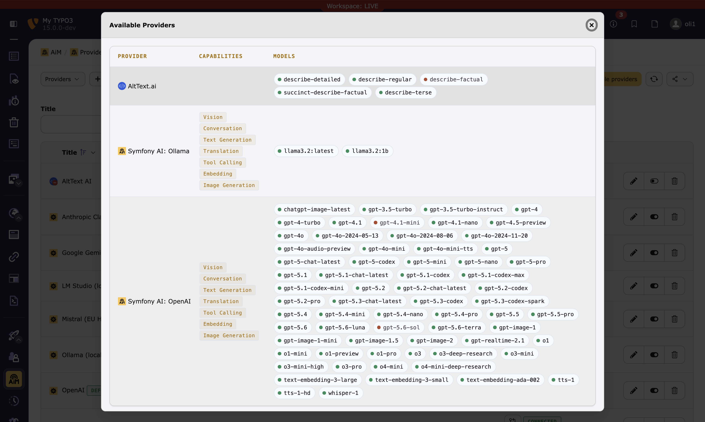
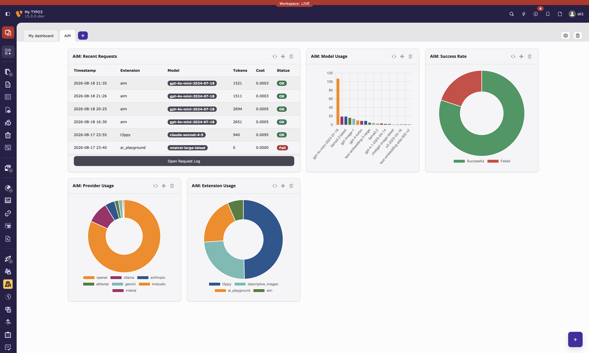
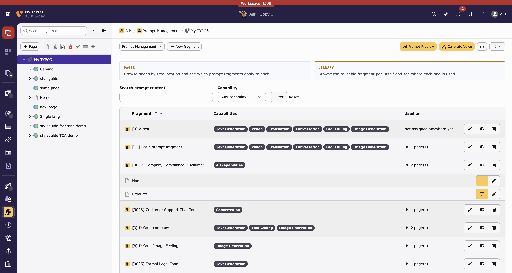
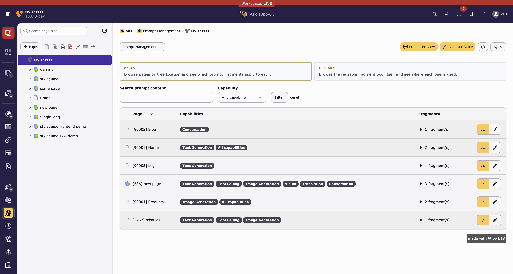
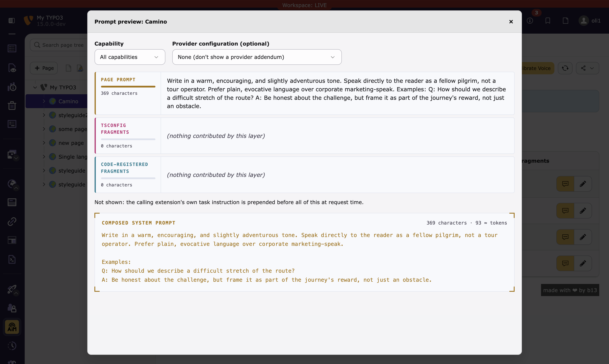
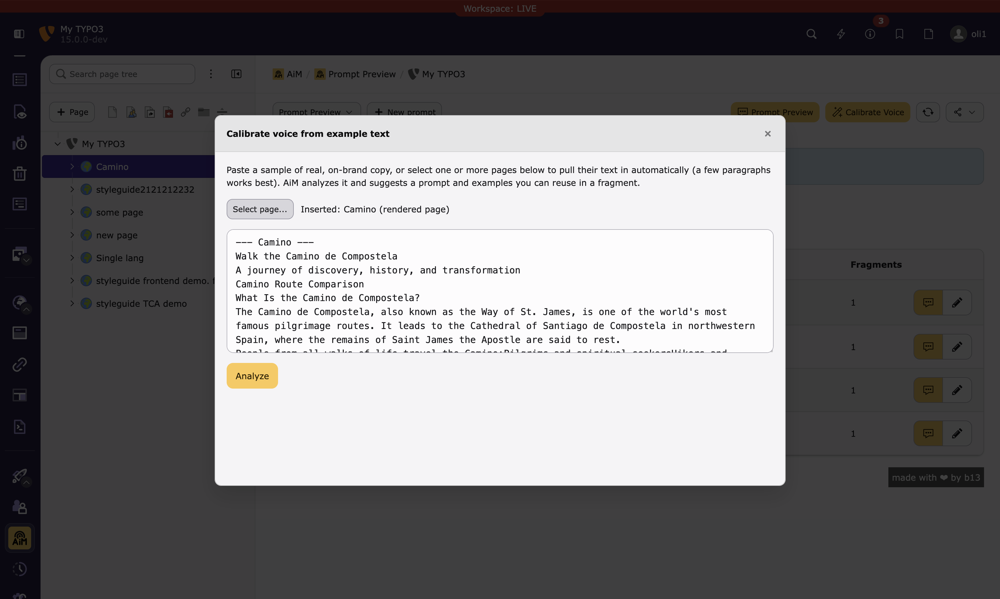

# AiM: The AI Brain for Your TYPO3 Website

## One extension. Every AI provider. Full control.

AiM connects your TYPO3 website to the world of artificial intelligence without locking you into a single vendor, without exposing your API keys to every extension, and without losing visibility into what AI is doing on your site.

Think of AiM as the **central switchboard** for all AI operations in TYPO3. Your extensions ask for what they need: "describe this image", "translate this text", "generate a meta description". AiM handles everything else: picking the right provider, routing to the right model, logging the request, tracking costs, and enforcing your security policies.

---

## Why AiM?

### The problem without AiM

Every TYPO3 extension that wants to use AI needs its own OpenAI integration. That means:
- API keys scattered across multiple extensions
- No overview of what AI is being used for
- No cost control, any extension can burn through your budget
- No way to switch providers without changing extension code
- No security boundaries, HR data could end up at a cloud provider

### The AiM approach

AiM sits between your extensions and AI providers. Extensions never touch API keys, never choose models, never talk to providers directly. They simply say what they need, and AiM delivers.

**For site administrators**, this means:
- One place to manage all AI provider configurations
- Full visibility into every AI request (who, what, when, how much)
- Budget limits per user or group
- Privacy controls for sensitive data
- The freedom to switch providers anytime

**For extension developers**, this means:
- Three lines of code to add AI to any feature
- No need to implement provider-specific APIs
- Automatic fallback if a provider goes down
- Smart routing that picks the cheapest model for simple tasks

---

## What can AiM do?

### Image analysis and alt text generation

Upload an image, get a description back. Perfect for accessibility: generate alt text for every image in your media library automatically.

### Content generation

Write meta descriptions, generate summaries, create content drafts. Tell AiM what you need and which tone to use.

### Translation

Translate content between any languages your AI provider supports. Tone, context, and meaning are maintained automatically.

### Conversations and chatbots

Build interactive chat experiences in the TYPO3 backend or frontend. Multi-turn conversations with context awareness, including streaming support for real-time token output.

### Embeddings and semantic search

Generate vector embeddings for content. Enable semantic search, find related content, build recommendation engines.

### Tool calling and agentic workflows

Let AI interact with your TYPO3 data. AI can call functions you define: query records, trigger actions, process data.

### Image generation

Every editor prompting an image generator on their own produces a different look, inconsistent styles, colors, and composition scattered across the site. Instead, pass an existing on-brand image as a **style reference** alongside the prompt. AiM asks the provider to generate an image-to-image edit guided by it, so headers, teasers, and illustrations stay visually consistent site-wide instead of looking like they came from ten different tools. Requires a provider/model that supports image output (e.g. OpenAI's `gpt-image-1`).

---

## How it works for administrators

Everything lives in one place: the **AiM** module under Admin Tools, with three sub-modules for providers, request monitoring, and prompt management (page-level tone plus the reusable fragment library behind it).



### 1. Install AiM and a provider bridge

```bash
composer require b13/aim
```

AiM itself has no AI provider built in. You choose what you need:

| Provider | Package | Use case |
|---|---|---|
| **OpenAI** (GPT-4.1, GPT-4o) | `symfony/ai-open-ai-platform` | Best all-rounder, vision, embeddings |
| **Anthropic** (Claude) | `symfony/ai-anthropic-platform` | Strong reasoning, long context |
| **Google Gemini** | `symfony/ai-gemini-platform` | 1M token context window |
| **Mistral** | `symfony/ai-mistral-platform` | European hosting, fast |
| **Ollama** (local) | `symfony/ai-ollama-platform` | On-premise, no data leaves your server |

Install any bridge and AiM detects it automatically, whoever publishes it: any Composer package of type `symfony-ai-platform` is found, not just Symfony's own. No configuration needed beyond the Composer install.
Of course, you can also create your own providers.

### 2. Create a provider configuration

In the TYPO3 backend, go to **Admin Tools > AiM > Providers** and create a new configuration. A hosted service needs its API key and a model. A provider of your own needs its **Endpoint URL** as well, which is a separate field from the credential: a self-hosted gateway usually wants both, and a local Ollama wants only the URL.

The credential is encrypted before it is stored and is never shown again, not in the form and not in any listing. Leaving the field empty on a later save keeps the stored one; a button next to it removes it.

The **Model** field may stay empty while you set the provider up. A host that only reveals its model list to an authenticated request cannot be asked before its credential is stored, so enter provider, endpoint and key, save, and the dropdown fills in on the next load. Until a model is picked, the configuration behaves as disabled.

Click the verify button to confirm the connection works. You'll see "connected" with the timestamp.

**Alternative: site settings YAML.** Extensions can also resolve provider configurations from your site's `settings.yaml` without any database records. This is useful for simple setups or automated deployments where you want to keep AI configuration in version control alongside your site config. Note that these values are not encrypted, since a settings file is usually version-controlled.

Every field, and a worked example for each provider shape, is in [Configuring a provider](ProviderConfiguration.md).

### 3. You're done

Every extension using AiM now has AI capabilities. No further configuration needed for basic usage.

---

## Smart features that save money

### Intelligent model routing

AiM analyzes each prompt's complexity before sending it to an AI provider. A simple "What is PHP?" doesn't need GPT-4.1. A smaller, cheaper model handles it just fine. AiM learns from your request history which models work well for which types of questions and automatically routes to the most cost-effective option.

If you also enable [response quality grading](#response-quality-grading), routing gets smarter still: a cheaper model is only chosen if its past answers were actually graded as good. Not just "didn't error". A model that runs cheaply but produces weak responses is left out of the downgrade. Until enough graded requests exist for a model, routing falls back to cost and reliability alone, so nothing changes for setups that don't use grading.

This happens transparently. Your extensions don't need to change anything.

### Auto model switching

You configured OpenAI with GPT-4.1 for chat. But an extension needs embeddings, and GPT-4.1 can't do that. Instead of failing, AiM automatically switches to the cheapest capable model (e.g. `text-embedding-3-small`) using the same API key. The selection is data-driven: AiM uses historical cost data from the request log to pick the cheapest model with a proven success rate. One configuration covers all AI capabilities.

The auto switch is controllable:
- Per configuration: toggle on/off in the provider record
- Per user/group: `aim.autoModelSwitch = 0` in TSconfig
- Admins always bypass restrictions

### Fallback chains

If your primary provider is down or returns an error, AiM automatically retries with the next available provider. Your users never see a failure.

---

## Security and governance

AiM is the only place that holds a provider credential, and it is the only place that decides who may spend it. Six controls, all through TYPO3's own mechanisms:

- **Capability permissions** per backend user group: text generation, vision, translation, embeddings, tool calling. Nothing is restricted until you restrict something.
- **Provider restrictions** per group, so the HR team's local Ollama configuration is theirs alone.
- **Rerouting protection** in both directions. One setting keeps a configuration's own requests from going elsewhere, so confidential work stays on the model it was designated for; a second controls whether other configurations may hand their traffic here. That combination is what lets a pinned local model still absorb an outage of the cloud default.
- **Privacy levels** per configuration: full logging, tokens and cost only, or no log entry at all.
- **Budgets** per user, in daily, weekly or monthly periods, by cost, tokens or request count.
- **A rate limit** that is on by default, at 60 requests per minute per backend user, so a fresh install is not uncapped.

Budgets and the rate limit apply to admins too. They are a safety net against an accidental bulk operation, not a permission system.

The settings, their TSconfig keys and how a credential is stored are in [Governance and access control](Governance.md).

---

## Full visibility

### Request log

Every AI request is tracked in the **AiM > Request Log** module:

- **What was asked**: prompt and response content is stored per request (respects privacy levels), accessible via the database for debugging
- **Which model answered**: requested model vs. actually used model
- **How much it cost**: token counts (prompt, completion, cached, reasoning) and calculated cost
- **How complex it was**: AiM's complexity classification (simple/moderate/complex) with the scoring reason
- **How good it was**: when grading is enabled, an LLM-as-a-judge quality score, label, and reason
- **How long it took**: wall-clock duration in milliseconds
- **Who asked**: the backend username is displayed for each request, so you can see which user triggered it. Automated/CLI requests show no user.
- **Which extension**: the calling extension key is shown per request
- **Rerouting details**: whether the request was rerouted (fallback, capability validation, smart routing) and why

Filter by provider, extension, request type, or success/failure. Statistics dashboard shows totals at a glance.



Click any row (or its dedicated details button) to open the **full request detail view**: the complete, untruncated prompt and response - the list only ever shows a short preview - alongside every other field recorded for that request. It's reachable via a stable, linkable URL (`aim_request_log.show`), so other extensions logging through AiM can link straight from their own UI to the exact request behind a piece of generated content, instead of sending editors to search the list manually.



### Response quality grading

How good are the AI responses your site produces? AiM can answer that automatically. Enable **LLM grading** on any provider configuration and AiM scores each response with a second AI model acting as an impartial judge ("LLM-as-a-judge").

You write the rubric ("evaluate factual accuracy and relevance", "check the tone is friendly and professional", ...) and pick which configuration acts as the judge, typically a cheaper model. After each response is delivered, AiM asks the judge to score it and records a grade (poor / fair / good / excellent), a 0–1 score, and a one-sentence reason on the request log row.

Grading runs *after* the response reaches the user, so it never slows anything down. It applies to text and conversation requests, and only when full logging is active, since the judge needs to see the content it is scoring. Grading is delivered by a shutdown handler on the live request, with a scheduler task (`aim:grade-pending`) as a safety net for anything it misses.

This turns the request log into a quality dashboard: spot which models or prompts produce weak answers, compare providers on real output, and catch quality regressions before your editors do.

### Provider verification

Click the verify button next to any provider configuration to test the connection. See "connected" or "disconnected" with the exact error message. Results are persisted so you see the last check status on every page load.



### Disabled models

In the Available Providers modal, click any model badge to disable it. Disabled models:
- Don't appear in the model selection dropdown
- Are never picked by the resolver, smart router, or auto model switch
- Are blocked by the capability validation middleware as a safety net



### Dashboard widgets

If the TYPO3 Dashboard extension is installed, AiM adds five widgets you can place on any dashboard:

- **Recent Requests**: a live table of the latest AI requests with model, tokens, cost, and status
- **Provider Usage**: doughnut chart showing how requests are distributed across providers
- **Model Usage**: bar chart showing request counts per model
- **Success Rate**: doughnut chart of successful vs failed requests
- **Extension Usage**: doughnut chart showing which extensions use AI the most

A pre-configured dashboard preset ("AiM: AI Analytics") is available when creating a new dashboard, placing all five widgets at once.



---

## A consistent tone of voice, site-wide

Every extension calling AiM can inherit a shared brand voice automatically, without changing a line of its own code.

### How the voice is defined

Editors add named **prompt fragments** directly from any page (a repeatable "AI" tab, right next to the page's other properties): an instruction ("write in a warm, second-person voice"), optional example text to steer the model further, and which AI capability it applies to. A fragment on a page also applies to everything below it in the page tree by default, so setting the tone once on a site's root page covers the whole site; a subsection can add its own fragment on top, or opt out of what it would otherwise inherit entirely.

A fragment is a reusable library entry, not something owned by one page: the same one can be assigned to several unrelated pages (or reused across sites), and editing it anywhere changes it everywhere it's assigned. The **AiM > Prompt Management** module's **Library** sub-action browses that pool directly, showing each fragment's own "used on N page(s)" list; selecting a page in the shared page tree scopes it to fragments actually used in that subtree. A site-wide fragment (not tied to any one page) stays listed regardless, marked with a "Global" badge so it doesn't read as specifically used near the selected page.



For AI requests with no page context at all (e.g. generating alt text for a file in the media library), a single site-wide fallback tone applies instead. Either way, a provider-specific addendum and any organization-wide policy an extension developer registers in code (a watermark instruction, a compliance disclaimer) are layered in automatically, last.

### Inspecting what will actually be sent

The **AiM > Prompt Management** module's **Pages** sub-action lists every page that has a configured fragment (only pages you're actually allowed to see), searchable and filterable by capability. Select a page in the built-in page tree to narrow the list to it and everything below it.



Click "Preview" on any row to see, without spending a single AI call, exactly what would be composed and sent for that page: the page's own tone, anything assigned to you personally, and any organization-wide policy, with a running character/token count.



### Calibrating the voice from real content

Writing a good tone-of-voice instruction by hand is tedious, and it's easy for it to drift from how the site actually reads. The **"Calibrate Voice"** button (in the Prompt Management module) does it for you: paste a sample of on-brand copy, or pick one or more existing pages directly from the page tree, and AiM derives a tone instruction plus illustrative example text from that real content, ready to copy into a fragment.



For a whole site at once, run:

```bash
vendor/bin/typo3 aim:calibrateVoice
```

This crawls a site's root page and a representative slice of its subpages, only pages a visitor could actually see, derives the same tone instruction and examples from the combined real content, and saves it as a fragment on the site's root page. It is saved **inactive**: the text comes from page copy nobody has vetted, so it applies to nothing until someone reads it and switches it on. Pass `--activate` to skip that gate, and `--scope` or `--no-inherit` to narrow where it applies. A later run never switches an activated fragment back off, so a scheduled refresh cannot undo a review.

---

How the layers are composed and what a consumer can read back is in [Tone of voice and system prompts](ToneOfVoice.md).

---

## For extension developers

Adding AI to your TYPO3 extension takes a few lines:

```php
public function __construct(
    private readonly \B13\Aim\Ai $ai,
) {}

// Generate alt text for an image
$response = $this->ai->vision(
    imageData: base64_encode($imageContent),
    mimeType: 'image/jpeg',
    prompt: 'Generate alt text for this image',
    extensionKey: 'my_extension',
);

echo $response->content;
// "A golden retriever playing fetch in a sunny park"
```

Your extension doesn't know or care which AI provider is used. The admin decides. You just describe what you need.

There are three levels of access: these proxy methods, a fluent builder for parameters like temperature and structured output, and the request pipeline itself when you need full control. You can register a provider of your own, and add middleware that runs on every request. The complete method list and an example of each is in [Using AiM from your extension](Usage.md).

---

## Where to read more

| Guide | What it covers |
|---|---|
| [Configuring a provider](ProviderConfiguration.md) | Every field of a provider configuration, an example per provider shape, site settings. |
| [Using AiM from your extension](Usage.md) | The proxy API, the fluent builder, pipeline access, structured output, tool calling, streaming. |
| [Governance and access control](Governance.md) | Credential storage, restrictions, budgets, rate limits, privacy levels, rerouting. |
| [Tone of voice](ToneOfVoice.md) | Prompt composition, page-tree fragments, the library, voice calibration. |
| [The request pipeline](Pipeline.md) | Smart routing, grading, the eleven stages, your own middleware. |
| [Backend modules](BackendModules.md) | The three modules, the dashboard widgets, the database tables. |

[CHANGELOG.md](../CHANGELOG.md) has the release notes, including the upgrade notes for 0.5.0.

---

## Requirements

- TYPO3 v12.4, v13.4, or v14.0+
- PHP 8.1+
- At least one AI provider bridge (see table above)

## License

GPL-2.0-or-later

## Credits

Created with 🧡 by [Oli Bartsch](https://github.com/o-ba) for [b13 GmbH, Stuttgart](https://b13.com).
