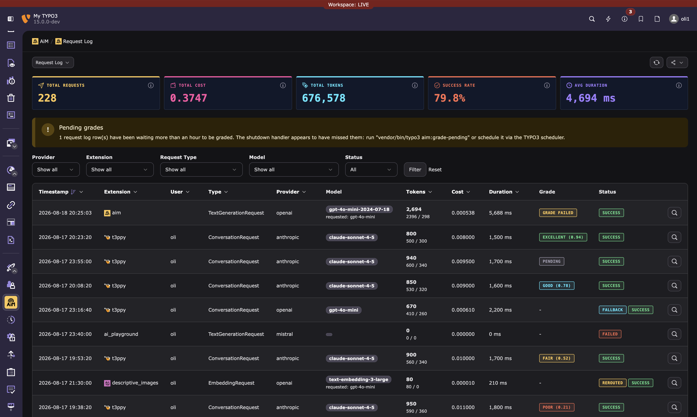

<div align="center">


# AiM

### Your extensions ask for AI.<br>AiM decides where the request goes, and keeps the receipt.

The central AI layer for TYPO3. An extension describes what it needs,<br>
AiM picks the provider and model, enforces the rules, and logs what it cost.

<p>
  <a href="https://github.com/b13/aim/actions/workflows/ci.yml"></a>
  
  
  
  
  
</p>



</div>

---

Three extensions in one installation, each with an API key of its own in its own extension configuration, each
talking to whichever provider its author happened to prefer, and no single place that knows what any of it cost.
Add a fourth and you do all of it again.

AiM is that single place. An extension says what it needs, alt text for this image, a translation of this text, and
AiM decides which configured provider answers, applies the tone of voice the site has set, enforces the budget,
the rate limit and the privacy rules, retries elsewhere when a provider fails, and writes down what happened.
Nothing about a provider, a key or a model lives in the calling extension.

> **New to AiM?** Read the [Introduction](Documentation/Introduction.md) for a non-technical overview of what AiM does, why it exists, and how it works for administrators and extension developers.

> **Alpha state.** AiM is under active development. The API is functional but may change before 1.0. We'd love your feedback: [open an issue](https://github.com/b13/aim/issues) or reach out at [b13.com](https://b13.com).

## Quick start

```php
use B13\Aim\Ai;

public function __construct(private readonly Ai $ai) {}

$response = $this->ai->vision(
    imageData: base64_encode($fileContent),
    mimeType: 'image/jpeg',
    prompt: 'Generate alt text for this image',
    extensionKey: 'my_extension',
);
echo $response->content; // "A golden retriever playing fetch in a sunny park"
```

A few lines to add AI to any TYPO3 extension. No API keys in your code, no provider lock-in, full logging and cost tracking out of the box.

## Key features

**For extension developers:**
- Simple proxy API (`$ai->vision()`, `$ai->text()`, `$ai->translate()`, `$ai->embed()`, `$ai->generateImage()`)
- Fluent builder for advanced parameters
- Image generation with reference-image style transfer
- Direct pipeline access for full control
- Structured output (JSON Schema), tool calling, streaming

**For administrators:**
- Backend modules for provider management, request monitoring, and prompt/tone management (page-level preview plus a reusable fragment library)
- Endpoint URL and credential in two separate fields, so a self-hosted gateway that needs both can be configured; the credential is always encrypted, never shown again, and can be removed
- Model lists read from the host itself, including one that requires a credential, and remembered so the form does not wait for it
- Disable specific models per provider by clicking them in the model list
- Budget limits and rate limiting per user (including admins as a safety net), the rate limit on by default
- Privacy levels (standard / reduced / none) per provider
- Rerouting protection in both directions: a configuration can be pinned to its own model, kept out of other configurations' traffic, or both
- Provider group restrictions and capability permissions via native TYPO3 mechanisms
- LLM grading: score response quality with a second model acting as a judge
- Tone of voice / system prompts: page-tree inherited, with a global fallback and optional per-provider addendum
- Voice calibration: derive a tone-of-voice fragment from real page content, interactively or via a site-wide crawl command, saved inactive until a human has read it

**Under the hood:**
- Zero provider dependencies. Install Symfony AI bridge packages as needed.
- Auto-discovery of installed bridges (OpenAI, Anthropic, Gemini, Mistral, Ollama, etc.)
- Capability-based routing with model-level awareness
- Auto model switch: one config covers all capabilities
- Smart routing: routes simple prompts to cheaper models based on historical cost, reliability, and (with grading) quality data
- Fallback chains: automatic retry with alternative providers on failure
- 11-stage middleware pipeline

## Installation

```bash
composer require b13/aim
```

AiM has **zero AI provider dependencies**. Install provider bridges as needed:

```bash
# For OpenAI
composer require symfony/ai-open-ai-platform

# For local models via Ollama
composer require symfony/ai-ollama-platform

# For Anthropic, Gemini, Mistral, etc.
composer require symfony/ai-anthropic-platform
composer require symfony/ai-gemini-platform
composer require symfony/ai-mistral-platform
```

Any installed package of Composer type `symfony-ai-platform` is **auto-discovered** at container compile time, whoever publishes it, so a third-party bridge is found as readily as Symfony's own. Models, capabilities, and features are read from the bridge's `ModelCatalog` automatically. A bridge without such a class is not treated as a bridge at all and is skipped.

Then create a provider configuration in the backend, under Admin Tools > AiM > Providers. [Configuring a provider](Documentation/ProviderConfiguration.md) walks through each field, with worked examples for hosted OpenAI and Anthropic, Ollama locally and in Docker, a token-checking proxy and an OpenAI-compatible gateway.

## Documentation

📖 **[Read the guides at b13.github.io/aim](https://b13.github.io/aim/docs/introduction.html)**. The same pages as
below, beautifully rendered rather than raw.

| Guide | What it covers |
|---|---|
| [Introduction](Documentation/Introduction.md) | What AiM is and why it exists, without the code. Start here if you are deciding whether to use it. |
| [Configuring a provider](Documentation/ProviderConfiguration.md) | Every field of a provider configuration, worked examples per provider shape, site settings, and registering a provider AiM does not know. |
| [Using AiM from your extension](Documentation/Usage.md) | The proxy API, the fluent builder, direct pipeline access, structured output, tool calling, streaming, and the capabilities you can ask for. |
| [Governance and access control](Documentation/Governance.md) | Credential storage, provider and capability restrictions, budgets, rate limits, privacy levels, and rerouting protection. |
| [Tone of voice](Documentation/ToneOfVoice.md) | How the prompt is composed, page-tree fragments and their inheritance, the fragment library, and voice calibration. |
| [The request pipeline](Documentation/Pipeline.md) | Smart routing, LLM grading, the eleven stages, and writing middleware of your own. |
| [Backend modules](Documentation/BackendModules.md) | Providers, Request Log and Prompt Management, the dashboard widgets, and the database tables. |
| [Development](Documentation/Development.md) | Running the tests, static analysis and coding standards on every supported TYPO3 and PHP version. |

[CHANGELOG.md](CHANGELOG.md) has the release notes, including important upgrade notes.

## Requirements

- TYPO3 v12.4, v13.4, or v14.0+
- PHP 8.1+
- No AI provider dependencies (bring your own via Symfony AI bridges or native implementations)

## License

GPL-2.0-or-later

## Credits

Created with 🧡 by [Oli Bartsch](https://github.com/o-ba) for [b13 GmbH, Stuttgart](https://b13.com).
